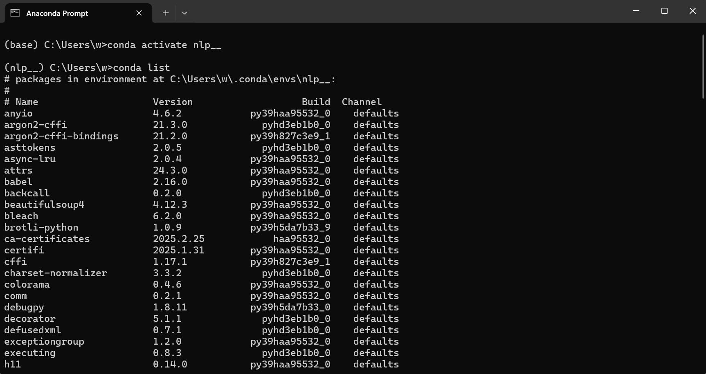
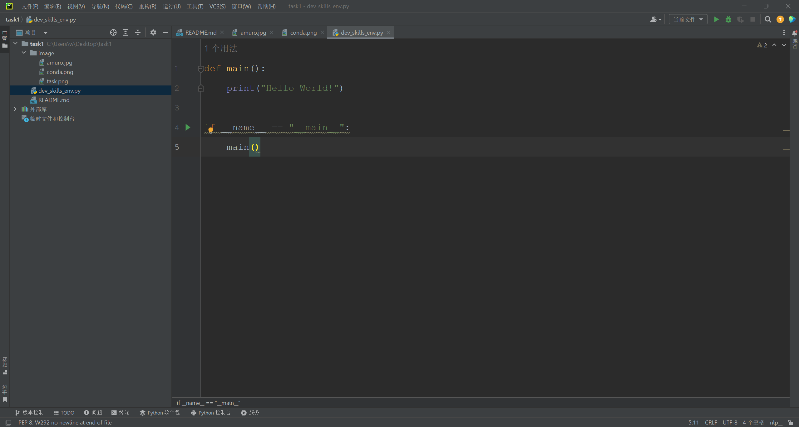

# 自我介绍


**大家好，我是阿姆罗**，我的身份是*驾驶员*。以下是我的自我介绍：

---

## 基础档案

### 外貌特征
- 棕色卷发
- 白色制服

## 我的好朋友
1. 拉拉
2. 布莱克
3. ~~夏亚~~

### 重要坐标
- 住址：[SIDE7](https://wiki.biligame.com/gundam/Side_7)
- 工作单位：[隆德贝尔](https://wiki.biligame.com/gundam/%E9%9A%86%E5%BE%B7%C2%B7%E8%B4%9D%E5%B0%94)
### 日常作息表
| 时间   | 活动 |
|--------|----|
| 8:00   | 起床 |
| 9:00   | 研究 |

### 人生信条
> 人类总是不断的犯同样的错误

---

## 我的专业是人工智能

## 我最喜欢的一段代码
```python
def main():
    print("Hello World!")

if __name__ == "__main__":
    main()
```
其中执行 python dev_skills_env.py 可输出结果。


我最喜欢的环境管理工具是conda



我可以在IDE上使用我建立的虚拟环境

